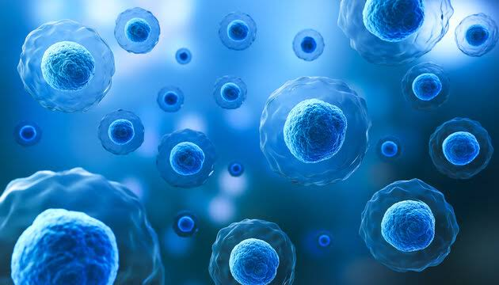

Segmentar objetos en imágenes
=============================

Buscar una receta o algoritmo e implemntarlo en un lenguaje de programación para cuantificar los elementos que conforman la 
siguiente imagen.

**Programa para leer y desplegar la imagen**

.. code:: Python

   import matplotlib.pyplot as plt
   import matplotlib.image as mpimg
   import numpy as np

   file = 'cell.jpg'

   # 1. Leer la imagen JPG
   img = mpimg.imread(file)

   # 2. Desplegar la imagen
   plt.imshow(img)

   plt.show()

