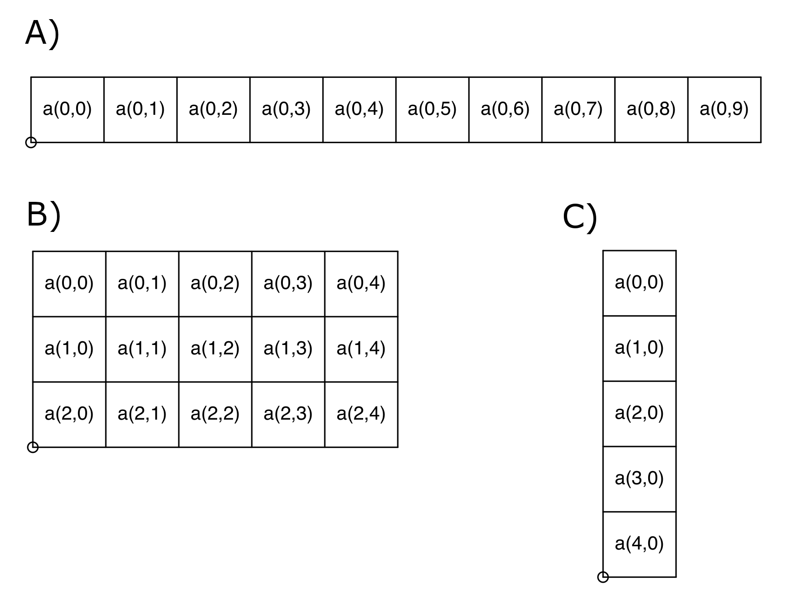
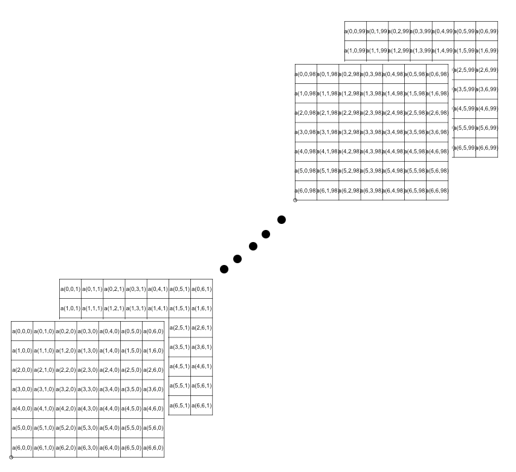

Módulo numpy (Numerical Python) 
===============================

Numpy es una biblioteca de clases para hacer calculos matemáticos y científicos de alata velocidad.

Los tipos de datos fundamentales que maneja numpy son: **vector, matrix y arreglo**

EStos se muestra en las siguientes figuras:

**Ejemplo de creación de este tipo de dato:s**

