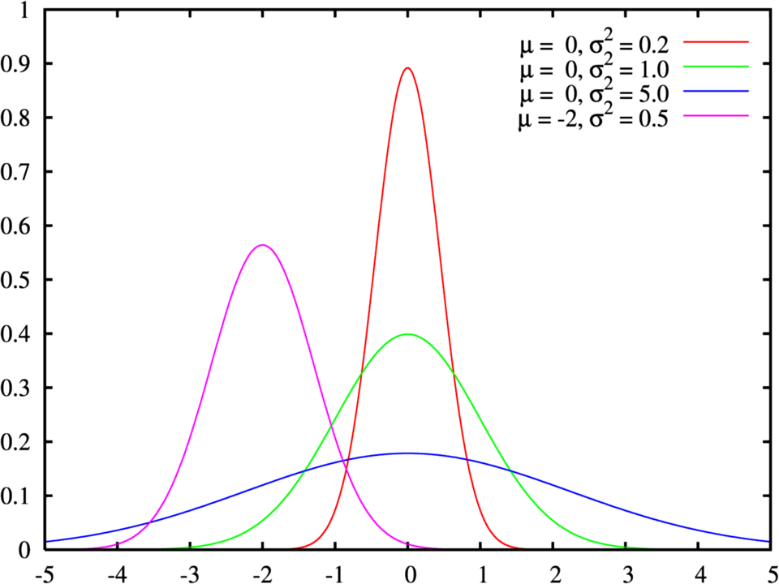
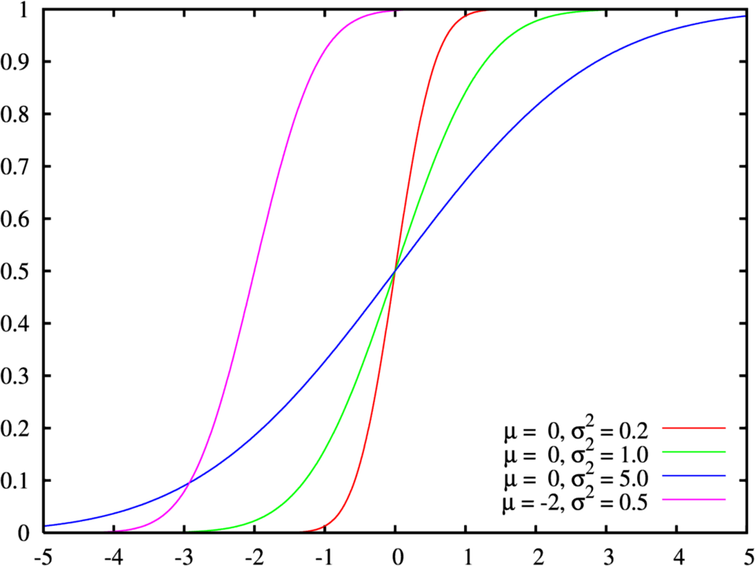
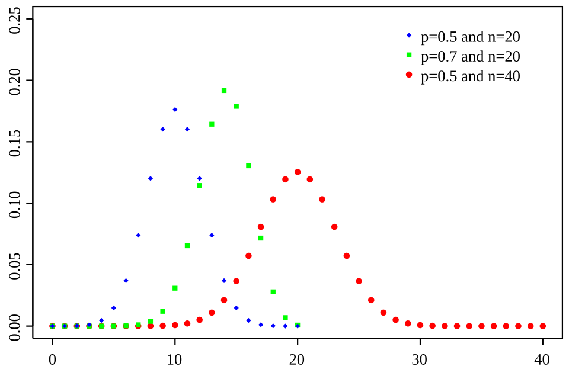
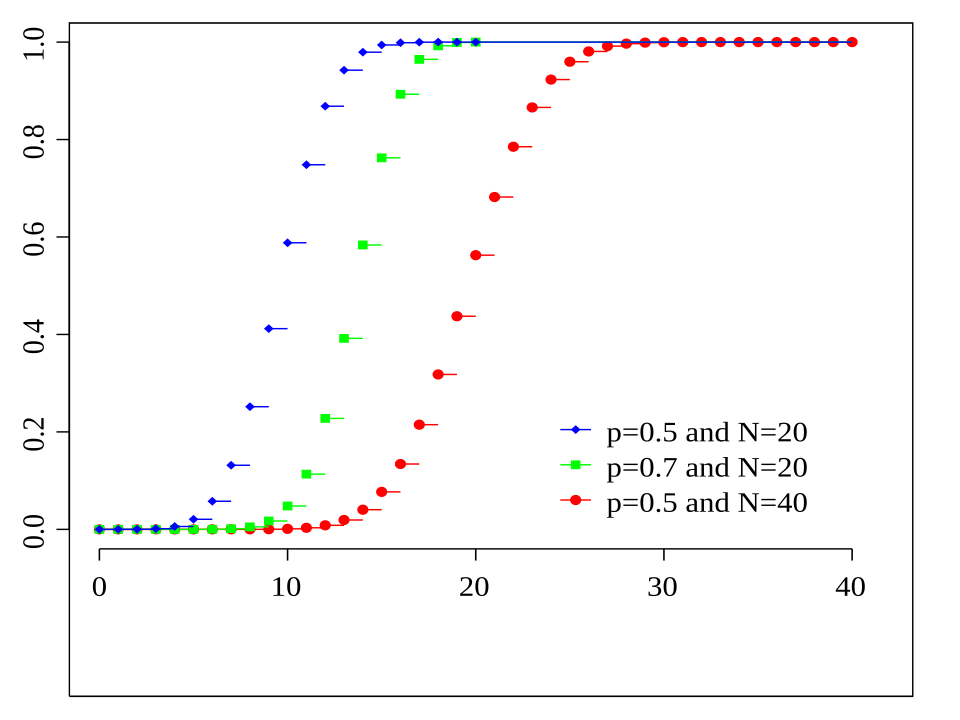

Algunas distribuciones de Probabilidad
======================================

**Continuas**

* Distribución Normal

En estadística y probabilidad se llama distribución normal, distribución de Gauss, distribución gaussiana a una gráfica de 
función de densidad con forma acampanada y simétrica respecto de un determinado parámetro estadístico. Esta curva se conoce como 
campana de Gauss y es el gráfico de una función gaussiana. Su forma general es:

.. math::

   f(x)={\frac {1}{\sqrt {2\pi \sigma ^{2}}}}e^{-{\frac {(x-\mu )^{2}}{2\sigma ^{2}}}}

Algunas graficas de la distribución son:

**Función de densidad de probabilidad**

**Función de distribución de probabilidad**

**Discretas** 

* Distribución binomial

En teoría de la probabilidad y estadística, la distribución binomial o distribución binómica es una distribución de probabilidad 
discreta que cuenta el número de éxitos en una secuencia de :math:`n` ensayos de Bernoulli independientes entre sí con una probabilidad fija 
:math:`p` de ocurrencia de éxito entre los ensayos. Un experimento de Bernoulli se caracteriza por ser dicotómico, esto 
es, solo dos resultados son posibles; a uno de estos se le denomina “éxito” y tiene una probabilidad de ocurrencia 
:math:`p`, y al otro se le denomina “fracaso” y tiene una probabilidad :math:`q = 1-p`.

Es posible entonces obtener la probabilidad de k éxitos en una repetición de n experimentos:

.. math::

   \mathbb {P} (X=k)={n \choose k}\,p^{k}(1-p)^{n-k}

Algunas graficas de la ditribución binomial:

**Función de probabilidad**

**Función de distribución acumulada**

