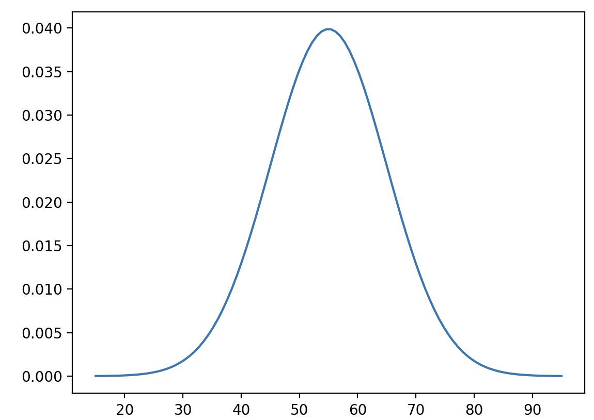

Distribución normal
===================

https://es.wikipedia.org/wiki/Distribuci%C3%B3n_normal

En estadística y probabilidad se llama **distribución normal**, **distribución de Gauss**, **distribución gaussiana** a una gráfica de 
la función de 
densidad con forma de campana y simétrica respecto a un determinado parámetro estadístico. Su forma general es:

.. math::

   \Large f(x)= \frac{1}{\sqrt{2\pi \sigma^2}} e^{-\frac{(x - \mu)^2}{2\sigma^2}}, \text{ en } -\infty < x < \infty

.. code:: Python

   import numpy as np
   import matplotlib.pyplot as plt

   mu = 55
   sd = 10

   x = np.linspace(mu-4*sd, mu+4*sd, 100)

   ex = (x - mu)**2/(2*sd**2)

   y = np.exp(-1*ex) / np.sqrt(2*np.pi*sd**2)

   plt.plot(x,y)
   plt.show()

