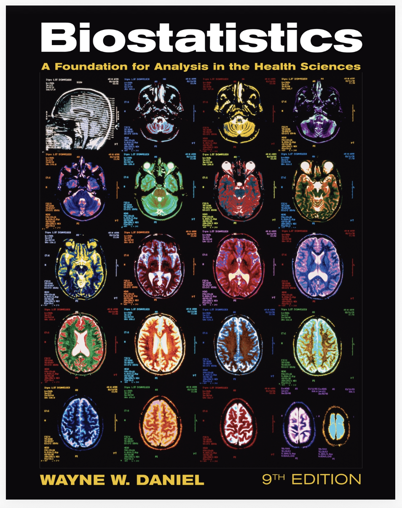
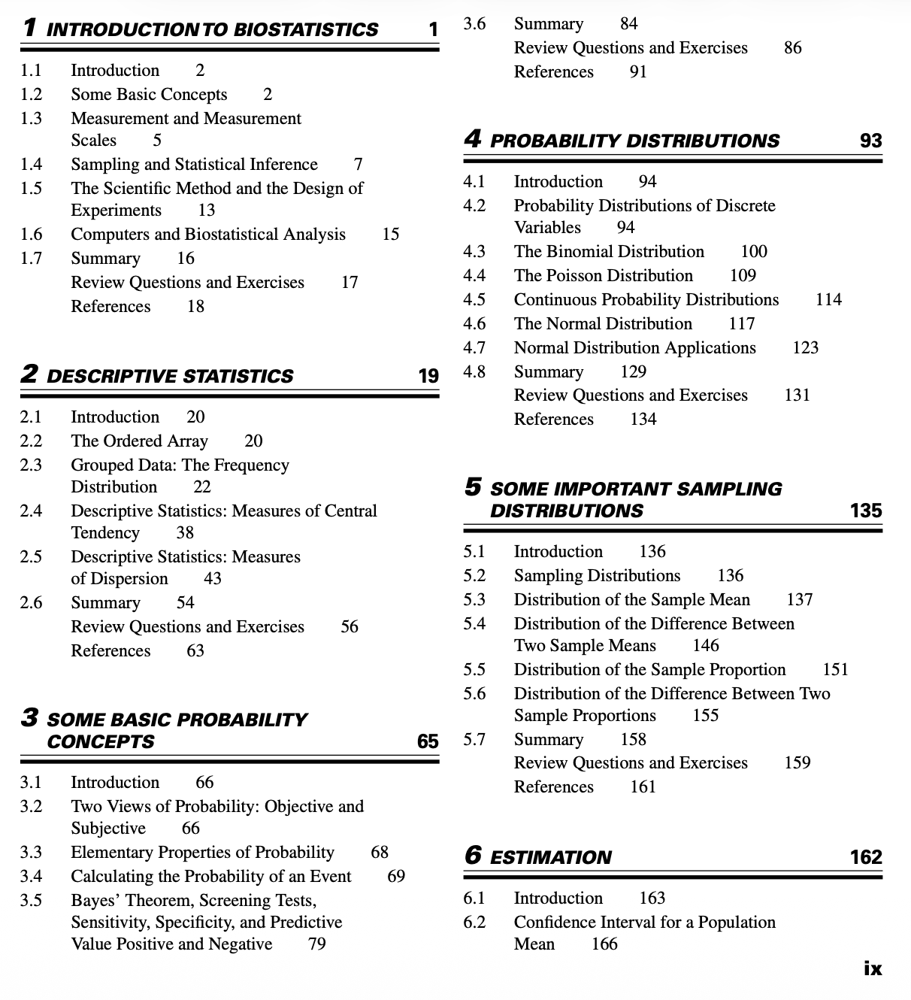
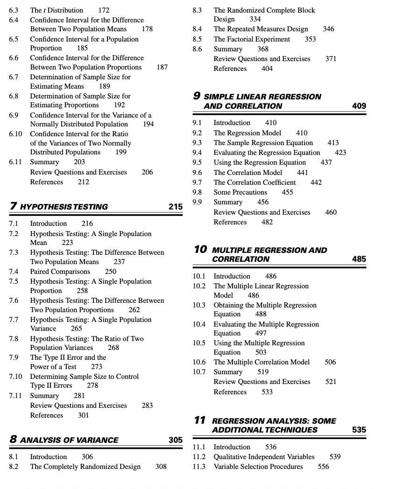
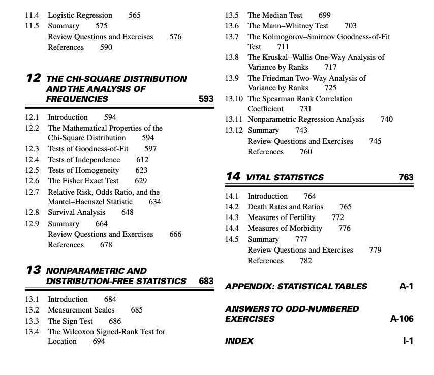
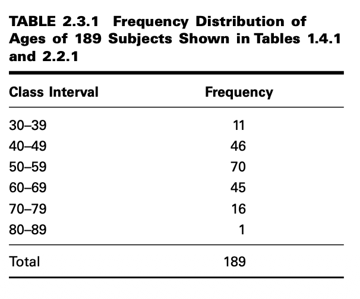
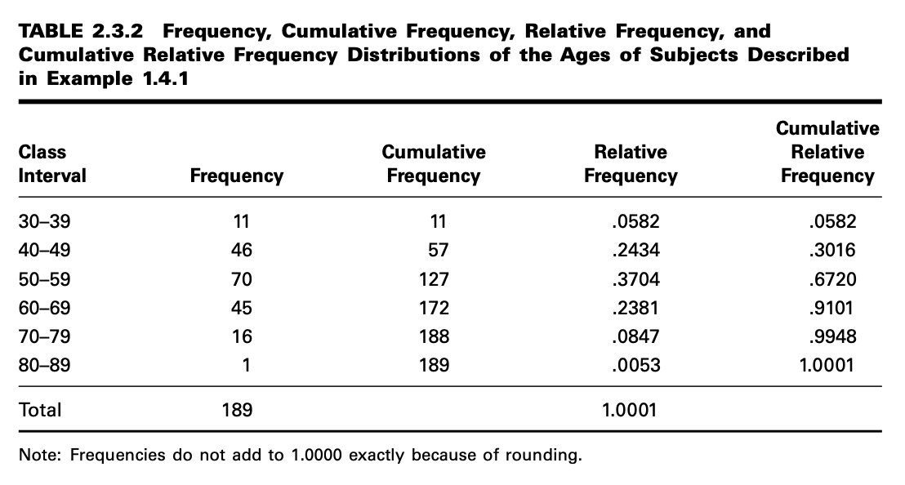

Probabilidad y EStadística
==========================

EXAMPLE 1.4.1

Gold et al. (A-1) studied the effectiveness on smoking cessation of bupropion SR, a nico-
tine patch, or both, when co-administered with cognitive-behavioral therapy. Consecutive
consenting patients assigned themselves to one of the three treatments. For illustrative pur-
poses, let us consider all these subjects to be a population of size N 189. We wish to
select a simple random sample of size 10 from this population whose ages are shown in
Table 1.4.1.

EXAMPLE 2.2.1

Table 1.4.1 contains a list of the ages of subjects who participated in the study on smok-
ing cessation discussed in Example 1.4.1. As can be seen, this unordered table requires
considerable searching for us to ascertain such elementary information as the age of the
youngest and oldest subjects.

**2.3 GROUPED DATA: THE FREQUENCY DISTRIBUTION**

EXAMPLE 2.3.1

We wish to know how many class intervals to have in the frequency distribution of the
data. We also want to know how wide the intervals should be.

**The Histogram**

