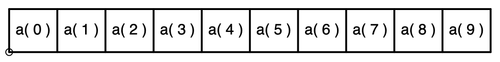
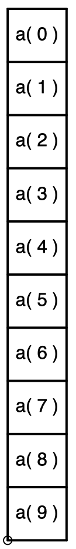
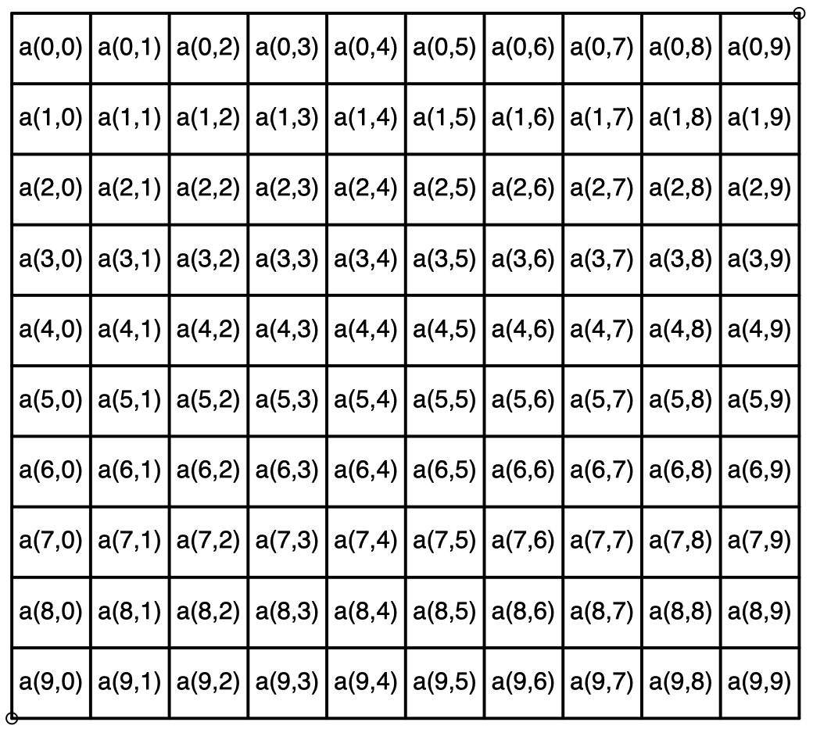
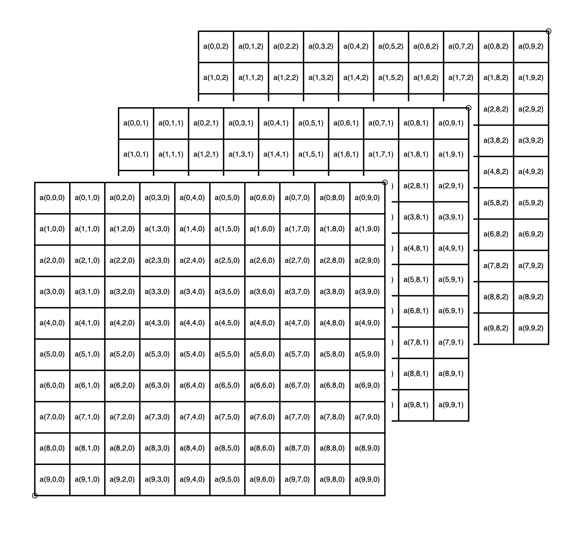

Estructuras de datos en el módulo numpy
=======================================

En el módulo ``numpy`` se tienen estructuras de datos de la siguiente forma:

**Vector fila**
 

**Vector columna**

**Matriz**

**Volumen ó Arreglo** Un arreglo es representado por una secuencia de imágenes de tres o más 
dimensiones: 

Esta representado por matrices apiladas del mismo tamaño.

