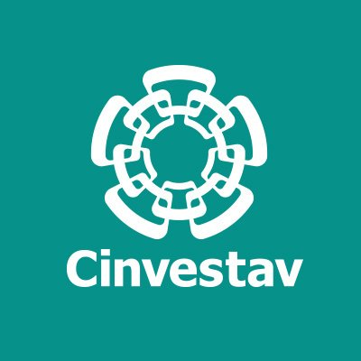
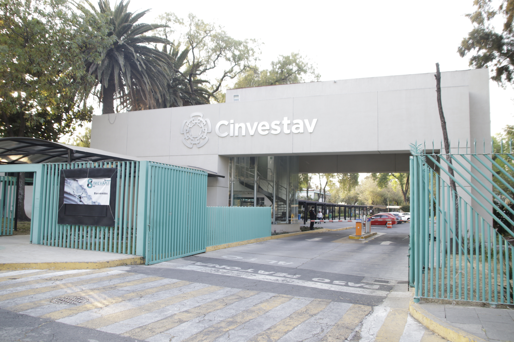
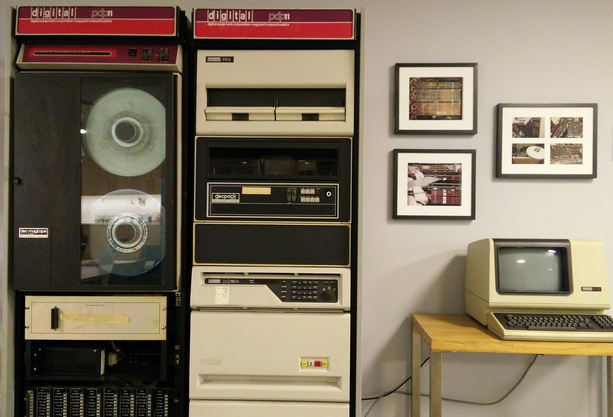
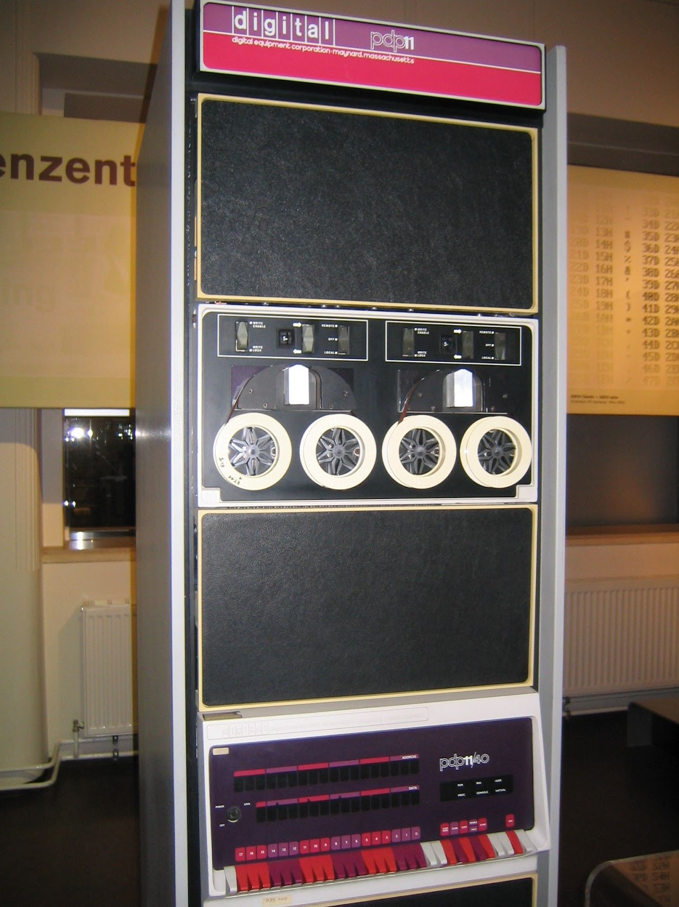
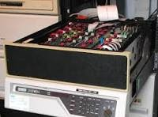
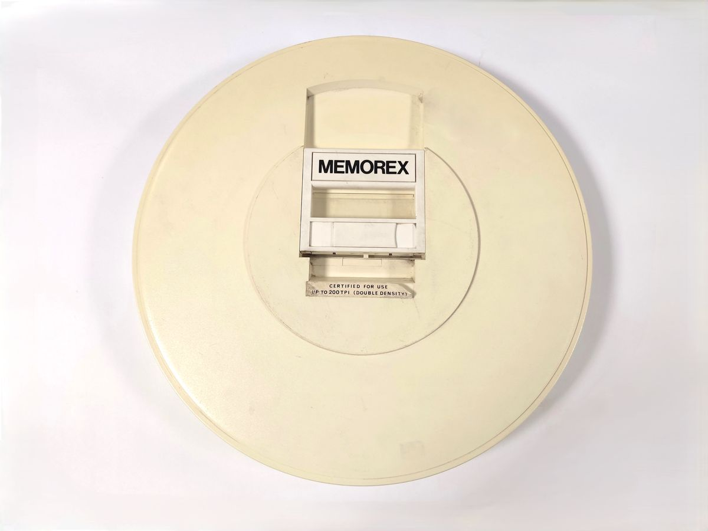

Tiempos para recordar ~ 1987
=====================

**ESTUVE TABAJANDO de 1985 a 1995 CON:**

**René Francisco Valdiosera Vázquez.** Investigador Titular. Doctor en Ciencias (1989) 
Cinvestav.

**Temas de investigación**: Estudio de los mecanismos responsables de diversos patrones de 
disparo 
neuronal. Estudio del mecanismo del :doc:`acople excitación-contracción en músculo estriado de 
anfibio <acople_excitacion>`. rvaldios@fisio.cinvestav.mx

**EQUIPO DE TRABAJO**

**PDF-1134**

La PDP-11/34 es una minicomputadora de 16 bits lanzada por Digital Equipment Corporation (DEC) 
en 1975. Funcionaba como un sistema de gama media, diseñado para reemplazar a bajo costo al 
modelo PDP-11/40, y se convirtió en uno de los equipos más exitosos de toda la 
familia.

**Arquitectura y Procesador**

* **Tipo de bus:** Máquina basada en el bus estándar UNIBUS.

* **CPU compacta:** La lógica central del procesador cabía en tan solo dos tarjetas de circuito impreso.

* **Variantes de CPU:** Utilizaba el modelo original KD11-E o la versión mejorada KD11-EA (denominada comercialmente como PDP-11/34A).

**Memoria y Gestión**

* **Memoria principal:** Limitada a un máximo de 248 KB (128 kWords) debido a las restricciones físicas de direccionamiento del UNIBUS.

* **Gestión de memoria:** Incluía capacidades de manejo y protección de memoria virtual para admitir sistemas operativos multiusuario y de tiempo compartido (time-sharing).

**Opciones y Extensiones**

* **Unidad de punto flotante:** Soportaba el coprocesador opcional FP11-A para acelerar cálculos matemáticos complejos.

* **Caché:** Permitía la instalación de una memoria caché KK11-A opcional para mejorar el rendimiento del sistema.

* **Almacenamiento común:** Operaba frecuentemente con unidades de disco duro removible como los modelos DEC RL01 y RL02.

Cartucho de disco duro extraíble como soporte magnético para el almacenamiento de datos. 
Memorex fundado en 1966 se dedicó inicialmente a la fabricación de discos duros extraíbles. El 
primer modelo 630 era compatible con el sistema IBM 2311. Este modelo, equivalente al IBM 
5440, contenía un único disco de doble cara de 14 pulgadas y era utilizable con la unidad de 
disco IBM 5444, elemento opcional para el equipo de gama media IBM System/3. 

Este formato de cartucho también se utilizó en otros sistemas, como las unidades RL01 y RL02 
de Digital Equipment Corporation (DEC), ya a partir de mediados de los años 70 y que permitían 
discos de mayor capacidad. Estas unidades se usaban con los minicomputadores DEC PDP-8 y 
PDP-11.

Especificaciones: Cartucho de 14 “. Capacidad: 2,5 MB.

Materiales: plástico, metal

Dimensiones: 38,2 Ø x 6,0 cm

**Lenguaje de Programación Ensamblador**

El lenguaje ensamblador oficial para la minicomputadora PDP-11/34 (y toda la familia PDP-11 de 
DEC) se denomina MACRO-11. Utiliza una arquitectura de 16 bits, ocho registros generales (R0 a 
R7) donde R6 actúa como puntero de pila (SP) y R7 como contador de programa (PC), destacando 
por un repertorio de instrucciones ortogonal y modos de direccionamiento 
avanzados.

**Arquitectura y Registros**

* R0 a R5: Registros de uso general para datos y cálculos.

* R6 (SP): Puntero de pila (Stack Pointer) para subrutinas y contexto.

* R7 (PC): Contador de programa (Program Counter), gestiona la dirección actual.

**Instrucciones Principales**

* MOV / MOVB: Mueve palabras (16 bits) o bytes (8 bits) de la fuente al destino.

* ADD / SUB: Suma y resta valores enteros.

* CLR / CLRB: Limpia un registro o localidad de memoria a cero.

* INC / DEC: Incrementa o decrementa en uno.

* JSR / RTS: Salto a subrutina y retorno.

**Modos de Direccionamiento**

* Inmediato: Los datos se definen con # (ej. MOV #377, R0).

* Registrado: El operando está en el registro (ej. MOV R1, R2).

**Lenguaje de Programación FORTRAN**

Fortran (Formula Translating System) es el primer lenguaje de programación de alto nivel de la 
historia. Creado por IBM en 1957, se especializa en el cálculo numérico, la física 
computacional y la ingeniería de alto rendimiento.

**Historia y Origen**

* Creado por John Backus en IBM.

* Diseñado para evitar escribir en código ensamblador.

* Permite escribir fórmulas matemáticas casi igual que en el papel.

* Dio inicio a la era de los compiladores modernos.

** Usos Principales**

* Modelado del clima y océanos.

* Simulaciones aeroespaciales y misiones espaciales.

* Cálculos para supercomputadoras y física de partículas.

**Características Clave**

* Soporte nativo para procesamiento paralelo.

* Tipado fuerte y estático.

* Gran velocidad en cálculos con matrices.

* Evolución constante desde versiones clásicas (como Fortran 77) hasta estándares modernos (Fortran 90 y posteriores).

**Install and Verify GFortran**

* Update your package lists:

sudo apt update

* Install the compiler:

sudo apt install gfortran

* Check the installed version:

gfortran --version

**Compile a Test Program**

* Create a new file named test.f90 with a text editor.

* Add a simple print statement:

**f90**

print *, "Hello,  World!"

end

* Compile the code:

gfortran test.f90 -o test

* Run the program:

./test

**Ejemplo de Lenguaje C**

.. code:: Bash

   #include <stdio.h>

   int main() {
      printf("Hola, mundo!\n");
      return 0;
   }

.. code:: Bash

   gcc ejem.c 

.. code:: Bash

   ./a.out 

** Ejemplo de lenguaje de Programación C++**

.. code:: Bash

   #include <iostream>
   using namespace std;

   int main() {
     cout << "Hola, Mundo!2" << endl;
     return 0;
   }

.. code:: Bash

   g++ ejemmm.cpp 

.. code:: Bash

   ./a.out 

aa `AQUi <https://www.python.org/downloads>`_

